# Realtime Streaming Image Processing (FPGA) - Zybo Z7-10 + Pcam 5C

Team: Lukas Roess, Valentin Bumeder, Jan Duchscherer

Target: [Digilent Zybo Z7-10 (Zynq-7010)](https://digilent.com/reference/programmable-logic/zybo-z7/start) + [Pcam 5C (OV5640)](https://digilent.com/reference/add-ons/pcam-5c/start)

## Clone

This repository uses a submodule at `vivado/vivado-git`.

```bash
git clone <repo-url>
cd realtime-image-processing
git submodule update --init --recursive
```

## Project Goal
Build a real-time streaming image-processing pipeline on FPGA (PL) on Zynq.

- Input: live camera video
- Processing: RGB -> grayscale -> 3x3 filtering (low-pass / Sobel) -> threshold / overlay
- Output: HDMI (optionally overlay edges on the original frame)
- Verification: [cocotb](https://docs.cocotb.org/en/stable/) + OpenCV golden model

## High-level Architecture



## Core Scope
- Streaming video I/O with framing (`SOF` / `EOL`)
- Native PL stream format: [`AXI4-Stream Video`](https://docs.amd.com/r/en-US/pg231-v-proc-ss/AXI4-Stream-Video) pixel stream.
- Fixed-point or shift-based RGB-to-grayscale
- BRAM-based line buffers + [window generator](docs/window_gen.md)
- 3x3 filters (Avg low-pass + Sobel `Gx/Gy`)
- Thresholding and optional overlay
- Cocotb testbenches with OpenCV golden models
- Debug hooks (ILA probes, counters, sanity assertions)

Optional extensions:
- FAST corner detector (+ NMS)
- Morphological operations (dilation / erosion)

## Toolchain
- FPGA build: AMD/Xilinx Vivado
- Verification: [cocotb](https://docs.cocotb.org/en/stable/) + OpenCV
- VHDL simulation: [NVC](https://github.com/nickg/nvc) or [GHDL](https://github.com/ghdl/ghdl)
- Waveforms: [Surfer](https://surfer-project.org/)

## Project Docs
- [PL Video Stream Representation](docs/pl_video_stream.md)
- [Window Generator Design Notes](docs/window_gen.md)
- [VHDL Style Guide](docs/style_guide.md)
- [Full Reference Index](docs/references.md)

## Key References
Camera bring-up follows Digilent's [Pcam 5C Demo](https://digilent.com/reference/programmable-logic/zybo-z7/demos/pcam-5c).

Video streaming conventions and IP integration follow AMD docs, especially [UG934 (AXI4-Stream Video)](https://docs.amd.com/r/en-US/ug934_axi_videoIP), [PG232 (MIPI CSI-2 RX)](https://docs.amd.com/r/en-US/pg232-mipi-csi2-rx), and [UG908 ILA Debug](https://docs.amd.com/r/en-US/ug908-vivado-programming-debugging/ILA).

Additional references and comparable implementations are collected in [docs/references.md](docs/references.md).
