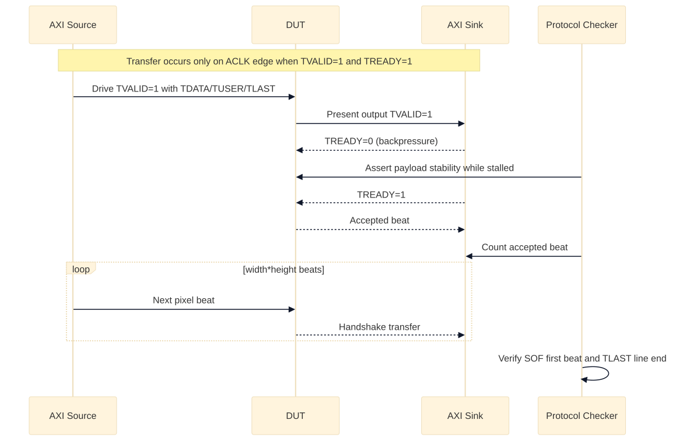
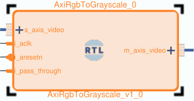
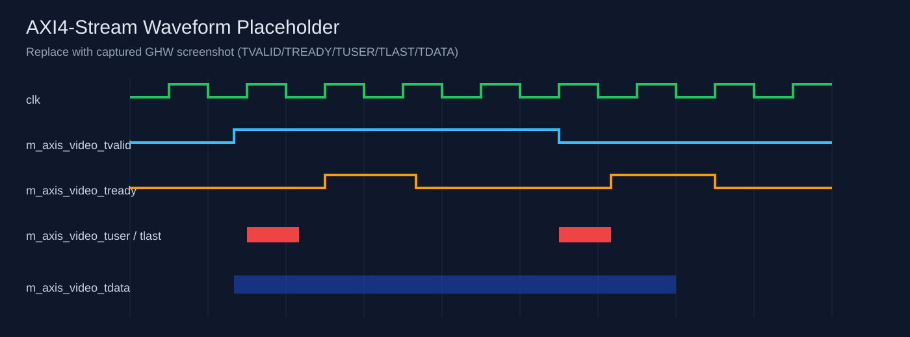
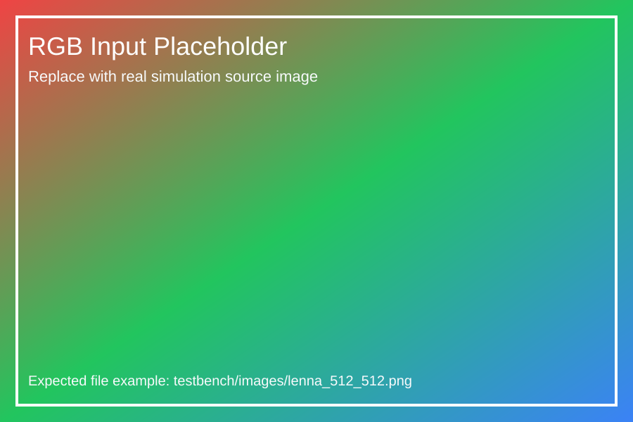
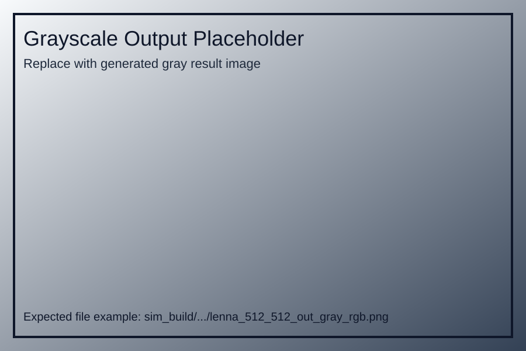
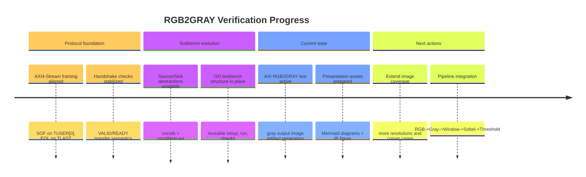

# Realtime Image Processing
## Project State (Verification + RGB2GRAY IP)

- Scope: testbench maturity, AXI4-Stream protocol confidence, and AXI_RGB2GRAY IP packaging status
- Repo: [`realtime-image-processing`](https://github.com/luroess/realtime-image-processing)
- Date: 2026-02-13

---

# Verification Framework Architecture

- Cocotb test modules drive source/sink adapters and compare output via scoreboard.
- `tb-sim` resolves target configuration and builds DUT RTL through GHDL.

---

# Verification Execution Flow

- Flow is image-driven: send frame, receive frame, protocol-check, score.
- Artifacts are produced per run: waveform, XML report, and image outputs.

---

# AXI4-Stream Handshake Narrative

- Transfer occurs only on clock edges with `TVALID && TREADY`.
- While stalled (`TVALID=1`, `TREADY=0`), payload sidebands must remain stable.

---

# AXI_RGB2GRAY IP Core (Current Snapshot)

- Core HDL:
  - `rtl/RGB_TO_GRAYSCALE/hdl/rgb_to_grayscale.vhd`
  - `rtl/RGB_TO_GRAYSCALE/hdl/axi_rgb_to_grayscale.vhd`
- Provides AXI4-Stream video in/out wrapper around grayscale conversion functionality.

---

# Simulation Evidence Placeholders

---

# Current Status, Risks, Next Actions

- Open risks:
  - Protocol regressions across additional resolutions and pause patterns.
  - Integration mismatches when chaining into the full Sobel pipeline.
- Next actions:
  - Expand regression image set and backpressure scenarios.
  - Integrate and validate in end-to-end `RGB -> Gray -> Window -> Sobel -> Threshold` flow.
