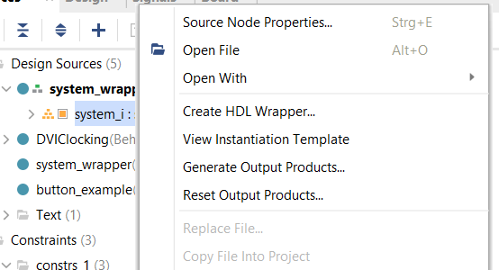
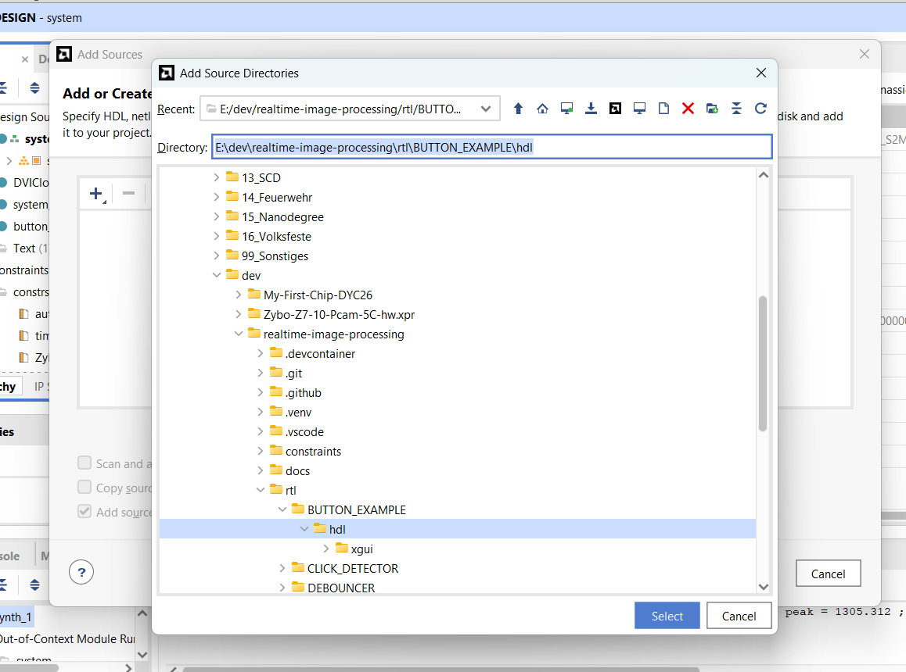
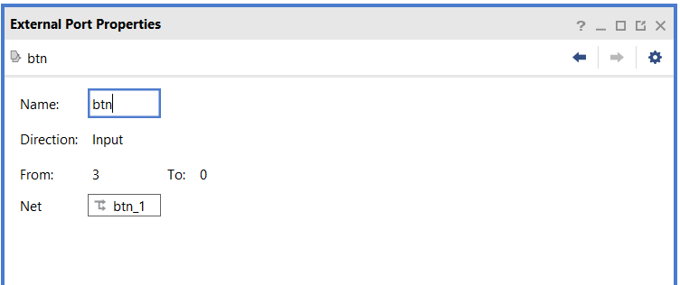
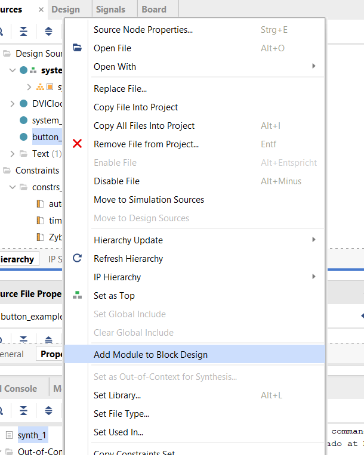
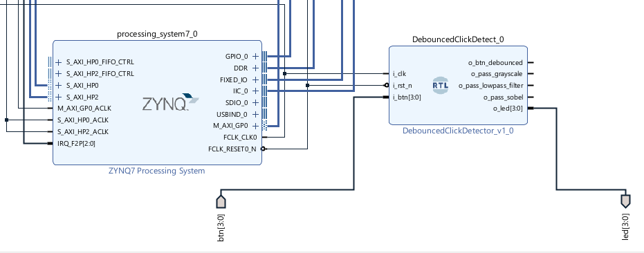

# Integration of Modules Debouncer and Click Detection into Vivado Project

## Vivado Setup
1. Download and unzip basic project: Zybo-Z7-10-Pcam-5C-hw.xpr.zip
2. Open */Zybo-Z7-10-Pcam-5C-hw.xpr/hw/hw.xpr* file in Vivado.
3. Open Block Design and lock IP Block *Zybo-Z7-10-Pcam-5C-hw.xpr* (Tab 'IP Sources' > 'Source File Properties' > 'USER_LOCKED')
4. Test Vivado Build Workflow (see below)

## Vivado Build Workflow
1. Open Block Design: *Tab 'Sources' > Sub-Tab 'Hierarchy'*
2. Right-Click node *'system_i (system.bd)'*

3. Create HDL Wrapper
4. Reset Output Products
5. Generate Output Products
6. Run Synthesis
7. Run Implementation
8. Generate Bitstream
9. Go to *File > Export > Hardware* and save it in the repository directory */vivado_outputs/<new_folder>/* (keep different states of "deployments")
10. Go to *File > Export > Bitstream File* and save it in the repository directory */vivado_outputs/<new_folder>/* (keep different states of "deployments")

## Vitis Deployment + Testing
1. Open basic Vitis Project: *Zybo-Z7-10-Pcam-5C-sw.ide*
2. Clear hw_pcam build. 
3. Clear pcam_hdmi build.
4. Open hw_pcam build settings: *hw_pcam > Switch / re-read XSA* > Select exported XSA-File in folder */vivado_outputs/<new_folder>/*
3. Open pcam_hdmi build settings: *pcam_hdmi > launch.json > Bitstream File* > Select exported Vivado Bitstream File in folder */vivado_outputs/<new_folder>/*

## Dummy Project "Button Example"
1. Add new Source to Vivado (HDL-File): 

2. Update Constraints-File *ZyboZ7_A.xdc*: 
    
    #Buttons
    set_property -dict { PACKAGE_PIN K18   IOSTANDARD LVCMOS33 } [get_ports { btn[0] }]; #IO_L12N_T1_MRCC_35 Sch=btn[0]
    set_property -dict { PACKAGE_PIN P16   IOSTANDARD LVCMOS33 } [get_ports { btn[1] }]; #IO_L24N_T3_34 Sch=btn[1]
    set_property -dict { PACKAGE_PIN K19   IOSTANDARD LVCMOS33 } [get_ports { btn[2] }]; #IO_L10P_T1_AD11P_35 Sch=btn[2]
    set_property -dict { PACKAGE_PIN Y16   IOSTANDARD LVCMOS33 } [get_ports { btn[3] }]; #IO_L7P_T1_34 Sch=btn[3]

    #LEDs
    set_property -dict { PACKAGE_PIN M14   IOSTANDARD LVCMOS33 } [get_ports { led[0] }]; #IO_L23P_T3_35 Sch=led[0]
    set_property -dict { PACKAGE_PIN M15   IOSTANDARD LVCMOS33 } [get_ports { led[1] }]; #IO_L23N_T3_35 Sch=led[1]
    set_property -dict { PACKAGE_PIN G14   IOSTANDARD LVCMOS33 } [get_ports { led[2] }]; #IO_0_35 Sch=led[2]
    set_property -dict { PACKAGE_PIN D18   IOSTANDARD LVCMOS33 } [get_ports { led[3] }]; #IO_L3N_T0_DQS_AD1N_35 Sch=led[3]

3. Open Block Design
4. Create Ports for btn & led in Block Design: 

5. Add Module to Block Design:

6. Wire Ports to Block Design: 
- btn-Port
- led-Port
- FCLK_CLK0-Clock from ZYNQ7 Processing System
7. Execute Vivado + Vitis Build Workflow

## Vivado Configuration for Debouncer + Click Detection

1. Add Source to Vivado (see dummy button implementation)
2. Update Constraints-File *ZyboZ7_A.xdc* (see dummy button implementation)
3. Open Block Design (see dummy button implementation)
4. Create Ports for btn & led in Block Design (see dummy button implementation)
5. Add Module to Block Design (see dummy button implementation)
6. Wire ports in block design: 

7. Execute Vivado + Vitis Build Workflow