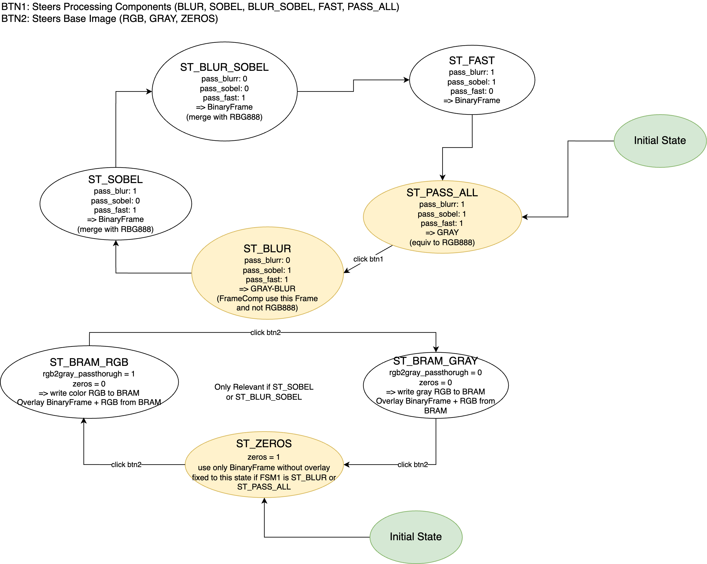
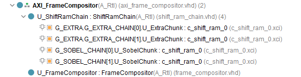

# FRAME_COMPOSITOR

`FrameCompositor` replaces deprecated `EDGE_OVERLAY`.
It merges a binary edge/corner mask onto an RGB base frame with mode-aware AXI routing.

## Current architecture

- `hdl/frame_compositor.vhd`:
  - combinational pixel merge (base RGB vs overlay color).
- `hdl/axi_frame_compositor.vhd`:
  - AXI4-Stream wrapper.
  - consumes delayed base RGB and processed `gray8` mask stream.
  - supports binary-only output via `i_overlay_zeros`.
- `hdl/shift_ram_chain.vhd`:
  - BRAM-shift delay chain using cascaded `c_shift_ram_0` taps.
  - fixed 26-bit payload packing `{SOF, EOL, RGB24}`.

## Control semantics

From `ClickDetector`:

- `o_pass_blurr_filter`, `o_pass_sobel`, `o_pass_fast`: processing FSM controls.
- `o_pass_grayscale`: base source selector.
  - `1`: RGB base from RGB2Gray pass-through.
  - `0`: gray replicated to RGB on base branch.
- `o_overlay_zeros`:
  - `1`: binary-only output (no base merge).
  - `0`: merge edge/corner mask onto delayed base RGB.

## Mode consequences for routing

Processing FSM consequences:

| State | pass_blurr | pass_sobel | pass_fast | Selected output path |
|---|---:|---:|---:|---|
| `ST_PASS_ALL` | 1 | 1 | 1 | direct `RGB2Gray.rgb888` (no buffering) |
| `ST_BLUR` | 0 | 1 | 1 | blurred chain output (`s_sobel_*` pass-through) |
| `ST_SOBEL` | 1 | 0 | 1 | compositor output, sobel-class base delay |
| `ST_BLUR_SOBEL` | 0 | 0 | 1 | compositor output, blur+sobel base delay |
| `ST_FAST` | 1 | 1 | 0 | compositor output, sobel-class base delay (placeholder) |

Base FSM consequences (only relevant in compositor/overlay states):

| Base state | `o_pass_grayscale` | `o_overlay_zeros` | Effect |
|---|---:|---:|---|
| `ST_BRAM_RGB` | 1 | 0 | merge mask with delayed color RGB base |
| `ST_BRAM_GRAY` | 0 | 0 | merge mask with delayed gray-as-RGB base |
| `ST_ZEROS` | 0 | 1 | output binary-only frame (no base merge) |

## BRAM delay model

Delay values are configured via `AXI_FrameCompositor` generics:

- `G_SOBEL_DELAY`
- `G_BLUR_SOBEL_DELAY`

In the current full-pipeline top (`rtl/PIPELINE/hdl/axi_rgb_gray_blurr_sobel_overlay_pipeline.vhd`),
they are computed using warm-up style stage delays:

`D_stage(K,W) = ((W + 1) * ((K - 1) / 2)) + 1`

and:

- `D_sobel = D_stage(3, W)`
- `D_blur_sobel = D_stage(G_BLURR_KERNEL_SIZE, W) + D_stage(3, W)`

For `W=512`, `G_BLURR_KERNEL_SIZE=3`:

- `D_sobel = 514`
- `D_blur_sobel = 1028`

Note: isolated compositor tests intentionally use wrapper defaults
`G_SOBEL_DELAY=1027`, `G_BLUR_SOBEL_DELAY=2054` to match the simulation
`c_shift_ram_0` latency model used in `test_shift_ram_chain.py` and
`test_axi_frame_compositor.py`.

## `c_shift_ram_0` tap mapping

Generated IP contract:

- width: 26 (`D[25:0]`, `Q[25:0]`)
- address/tap port: `A[9:0]`
- depth: 1024 (`A=1023` means 1024-beat delay)

How FIFO/shift length is determined:

1. Delay lengths are selected in pipeline top (`AXI_RgbGrayBlurrSobelOverlayPipeline`) and passed to
   `AXI_FrameCompositor` generics:
   - `G_SOBEL_DELAY`
   - `G_BLUR_SOBEL_DELAY`
2. `ShiftRamChain` splits each target delay into 1024-pixel chunks plus one residual chunk.
3. Chunk count and each chunk `A` value are compile-time constants (generated by `for generate`).

Examples:

1. `1027 = 1024 + 3`
   - chunk0: `A=1023`
   - chunk1: `A=2`
2. `2054 = 1024 + 1024 + 6`
   - chunk0: `A=1023`
   - chunk1: `A=1023`
   - chunk2: `A=5`

`ShiftRamChain` stage select:

- `00`: bypass (0 delay)
- `01`: sobel-class delay (`G_SOBEL_DELAY`)
- `10`: blur+sobel delay (`G_BLUR_SOBEL_DELAY`)

Common standalone/simulation values are `1027` and `2054`.

## AXI integration requirements

1. Frame-latch control at `SOF`:
   - processing/base control signals are sampled once per frame and held for that frame.
2. Non-overlay modes:
   - do not route frame output through compositor.
   - `ST_PASS_ALL`: output direct RGB2Gray `rgb888`.
   - `ST_BLUR`: output blurred chain.
3. Overlay modes:
   - use compositor output.
   - base stream is delayed in BRAM shift chain.
   - gray stream is mask/timing reference.
4. Binary-only mode (`o_overlay_zeros='1'`):
   - output binary RGB mask directly, independent of base merge.

## Inspected figures

### Processing + base-state sketch

`docs/figures/fsm.png`:

Observed alignment with implementation intent:

- processing FSM initial state shown as `ST_PASS_ALL`
- base-image FSM (`ST_BRAM_RGB` / `ST_BRAM_GRAY` / `ST_ZEROS`) only matters in overlay states
- `ST_ZEROS` corresponds to binary-only output behavior (`i_overlay_zeros='1'`)

### Vivado hierarchy snapshot

`docs/figures/image.png`:

Observed structure:

- `U_ShiftRamChain` contains Sobel chunk chain plus extra chain
- generated hierarchy currently shows two Sobel chunks and two extra chunks
- `U_FrameCompositor` is fed from aligned stream outputs of that chain

## Related tests and test-cases (FRAME_COMPOSITOR)

Latest review run date: `2026-02-19`.

| Target | Test cases | Latest status | Repro command |
|---|---|---|---|
| `frame_compositor_core` | `test_frame_compositor_all_input_combinations` | `PASS` (1/1) | `cd testbench && uv run tb-sim --target frame_compositor_core` |
| `shift_ram_chain` | `test_shift_ram_chain_delay_select_none` `test_shift_ram_chain_sobel_delay_1027` `test_shift_ram_chain_blur_sobel_delay_2054` | `PASS` (3/3) | `cd testbench && uv run tb-sim --target shift_ram_chain` |
| `axi_frame_compositor` | `test_axi_frame_compositor_multiframe_sync_with_gray_delay_and_backpressure` `test_axi_frame_compositor_downscaled_real_image_sequence` `test_axi_frame_compositor_small_mode_matrix_with_backpressure_and_gray_delays` `test_axi_frame_compositor_delay_stage_sweep_with_backpressure` `test_axi_frame_compositor_binary_mode_not_blocked_by_rgb` | `PASS` (5/5) | `cd testbench && uv run tb-sim --target axi_frame_compositor` |
| `axi_gray_blurr_sobel_overlay_pipeline` | `test_pipeline_full_chain_state_progression` `test_pipeline_full_chain_smoke_with_backpressure` | `FAIL` (wall-time timeout) | `cd testbench && timeout 420s uv run tb-sim --target axi_gray_blurr_sobel_overlay_pipeline` |
| `axi_gray_blurr_sobel_overlay_pipeline_downscaled` | `test_pipeline_downscaled_real_image_overlay_saved` | `FAIL` (`AssertionError: Timed out waiting for output frame`) | `cd testbench && uv run tb-sim --target axi_gray_blurr_sobel_overlay_pipeline_downscaled` |
| `test_click_detector` | `test_click_state_machine` | `PASS` (1/1) | `cd testbench && uv run tb-sim --target test_click_detector` |
| `test_debounced_click_detector` | `test_debounced_click_detection` | `PASS` (1/1) | `cd testbench && uv run tb-sim --target test_debounced_click_detector` |

## Current issues and resolution instructions

Open items as of `2026-02-19`:

1. `HIGH`: Full compositor integration target does not complete in bounded wall time.
   - Evidence:
     - `timeout 420s uv run tb-sim --target axi_gray_blurr_sobel_overlay_pipeline` => timeout.
     - `COCOTB_TEST_FILTER='test_pipeline_full_chain_state_progression' timeout 420s uv run tb-sim --target axi_gray_blurr_sobel_overlay_pipeline` => timeout.
     - `COCOTB_TEST_FILTER='test_pipeline_full_chain_smoke_with_backpressure' timeout 180s uv run tb-sim --target axi_gray_blurr_sobel_overlay_pipeline` => timeout.
   - Resolution instructions:
     - In `rtl/PIPELINE/hdl/axi_rgb_gray_blurr_sobel_overlay_pipeline.vhd:168`, stop hard-forcing `s_fc_delay_stage_sel <= C_DELAY_SEL_NONE`.
     - Derive delay stage from active processing state (`SOBEL/FAST -> C_DELAY_SEL_SOBEL`, `BLUR_SOBEL -> C_DELAY_SEL_BLUR_SOBEL`, others `C_DELAY_SEL_NONE`).
     - Re-run both tests in `tests.test_axi_gray_blurr_sobel_overlay_pipeline` and require `results.xml` generation.

2. `HIGH`: Downscaled real-image pipeline test times out waiting for first output frame.
   - Evidence:
     - `testbench/sim_build/test_axi_gray_blurr_sobel_overlay_pipeline_downscaled/axi_gray_blurr_sobel_overlay_pipeline_downscaled_axi_rgbgrayblurrsobeloverlaypipeline/build/results.xml`
     - failing case: `tests.test_axi_gray_blurr_sobel_overlay_pipeline_downscaled.test_pipeline_downscaled_real_image_overlay_saved`
     - failure: `AssertionError: Timed out waiting for output frame (64x64, 491520 ns per line)`.
   - Resolution instructions:
     - Add temporary handshake assertions/probes at `s_fc_rgb_*`, `s_fc_gray_*`, and `s_overlay_*` in `rtl/PIPELINE/hdl/axi_rgb_gray_blurr_sobel_overlay_pipeline.vhd`.
     - Verify no one-sided-valid deadlock between upstream grayscale and compositor merge path.
     - Re-run: `cd testbench && uv run tb-sim --target axi_gray_blurr_sobel_overlay_pipeline_downscaled`.

3. `HIGH`: `AXI_FrameCompositor` bypass mode can ignore downstream backpressure on RGB base input.
   - Evidence:
     - `rtl/FRAME_COMPOSITOR/hdl/axi_frame_compositor.vhd:197` to `rtl/FRAME_COMPOSITOR/hdl/axi_frame_compositor.vhd:201`.
   - Resolution instructions:
     - In `s_need_rgb='0'` mode, avoid unconditional `s_axis_rbg888_tready='1'`.
     - Either stop consuming RGB (`tready='0'`) when base is unused, or explicitly throttle with downstream acceptance and document drop behavior.
     - Add/keep a dedicated backpressure test that stalls `m_axis_video_rbg888_tready` while checking no uncontrolled RGB consumption.

4. `MEDIUM`: delayed-valid shift register can retain stale valid bits across pauses.
   - Evidence:
     - `rtl/FRAME_COMPOSITOR/hdl/axi_frame_compositor.vhd:146` to `rtl/FRAME_COMPOSITOR/hdl/axi_frame_compositor.vhd:160`.
   - Resolution instructions:
     - Shift the valid pipe every cycle and inject `0` when no accept occurs, or replace with explicit occupancy/count tracking tied to accepted beats.
     - Validate with prolonged pause patterns in `test_axi_frame_compositor_delay_stage_sweep_with_backpressure`.

5. `MEDIUM`: illegal delay selector values silently fall back to Sobel path.
   - Evidence:
     - `rtl/FRAME_COMPOSITOR/hdl/axi_frame_compositor.vhd:162` to `rtl/FRAME_COMPOSITOR/hdl/axi_frame_compositor.vhd:166`
     - `rtl/FRAME_COMPOSITOR/hdl/shift_ram_chain.vhd:138` to `rtl/FRAME_COMPOSITOR/hdl/shift_ram_chain.vhd:143`.
   - Resolution instructions:
     - Add simulation assertions for illegal selector values.
     - Prefer safe fallback to `C_SEL_NONE`/`C_DELAY_SEL_NONE` in synthesis path if assertion is not tripped.

6. `MEDIUM`: FAST and Sobel overlays currently share the same binary mask source.
   - Evidence:
     - `rtl/FRAME_COMPOSITOR/hdl/axi_frame_compositor.vhd:127` to `rtl/FRAME_COMPOSITOR/hdl/axi_frame_compositor.vhd:128`
     - `rtl/FRAME_COMPOSITOR/hdl/axi_frame_compositor.vhd:206` to `rtl/FRAME_COMPOSITOR/hdl/axi_frame_compositor.vhd:208`.
   - Resolution instructions:
     - Extend compositor wrapper interfaces for independent FAST/Sobel mask streams or explicit selected-mask muxing.
     - Add test vectors where FAST and Sobel masks differ to prove independent behavior.

7. `MEDIUM`: upstream `AXI_RgbToGrayscale` still uses tightly coupled ready/valid gating across both outputs.
   - Evidence:
     - `rtl/RGB_TO_GRAYSCALE/hdl/axi_rgb_to_grayscale.vhd:57` to `rtl/RGB_TO_GRAYSCALE/hdl/axi_rgb_to_grayscale.vhd:69`.
   - Resolution instructions:
     - Decouple branches with per-output skid buffering and AXI-compliant TVALID hold semantics.
     - Then enable real compositor delay-stage selection in pipeline integration without deadlock risk.
