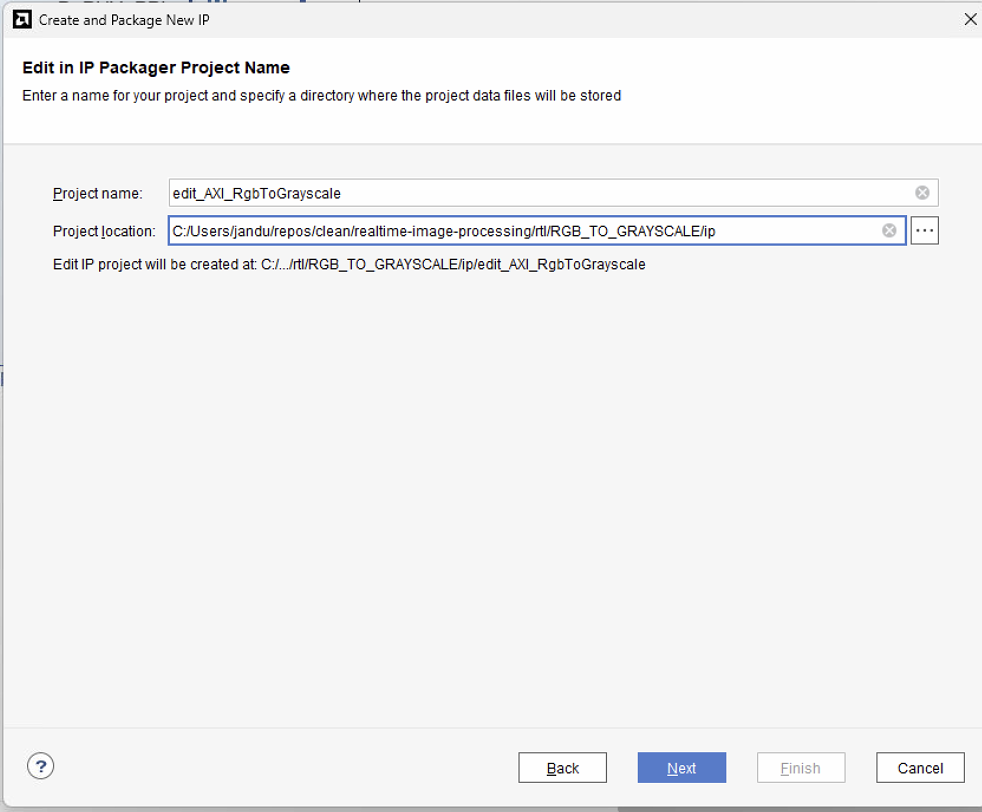
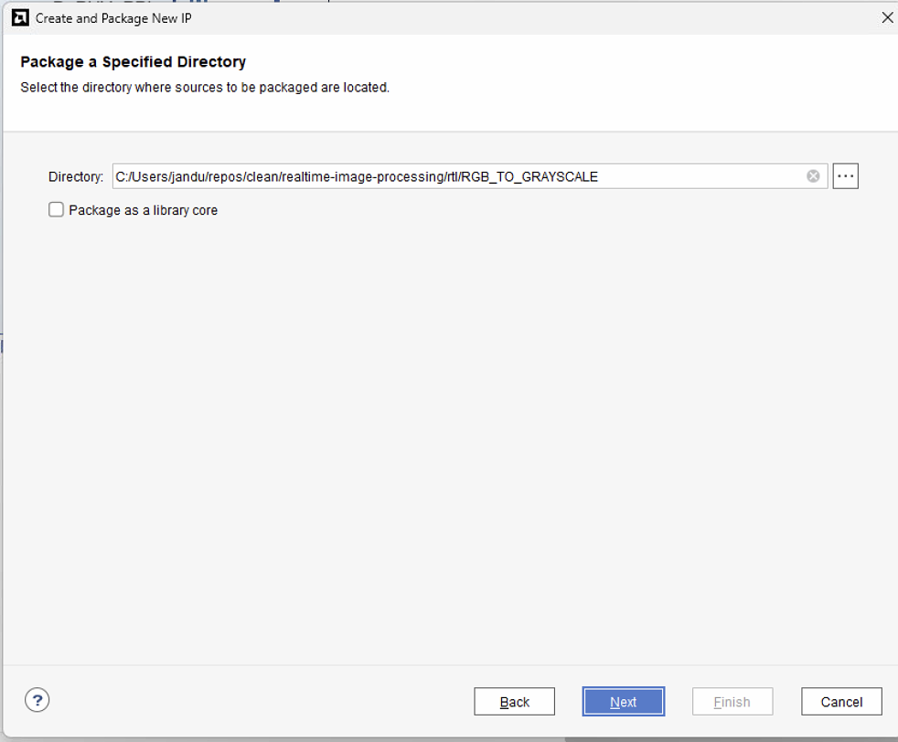
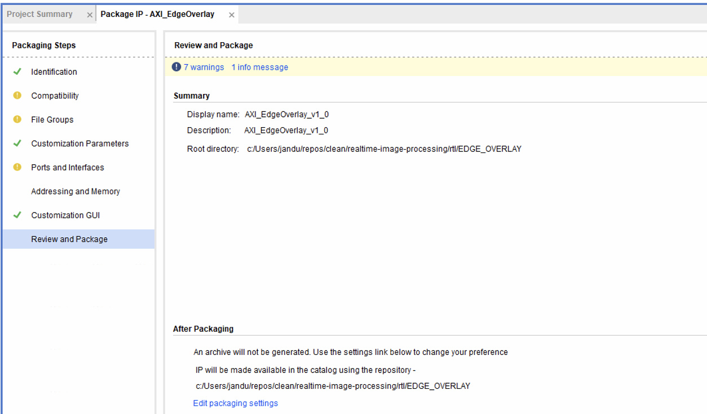
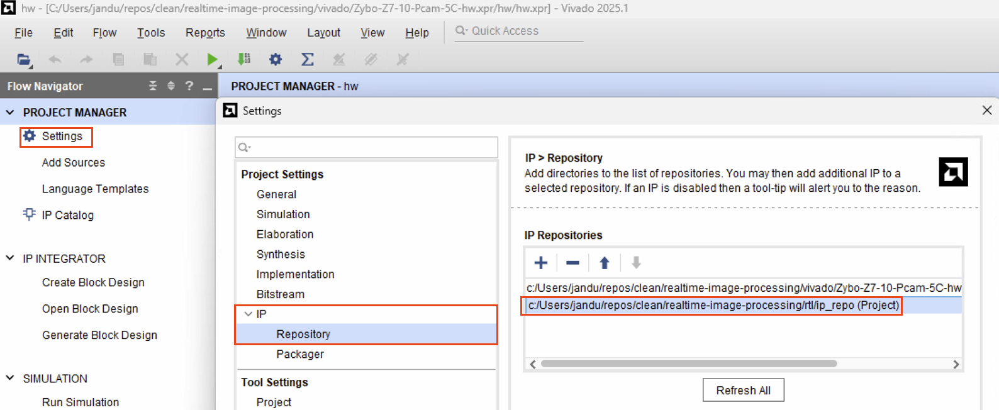

# RTL IP Packaging

- `rtl/` is the source of truth for custom RTL and custom packaged IP.
- Each IP component lives in `rtl/COMPONENT_NAME/`.
- Keep one canonical package per VLNV (no duplicates in multiple repo folders).

## Minimal component structure

```text
rtl/
└── COMPONENT_NAME/
    ├── COMPONENT_NAME.md          # user-created docs (optional but recommended)
    ├── component.xml              # generated by Vivado IP Packager
    ├── hdl/
    │   ├── <top_wrapper>.vhd      # user-created RTL
    │   └── <core>.vhd             # user-created RTL
    ├── ip/
    │   └── edit_<IP_NAME>.xpr     # Edit IP project (create this)
    └── xgui/
        └── <IP_NAME>_v1_0.tcl     # generated by Vivado IP Packager
```

## Packaging workflow

1. Create/Edit the IP project.

- Open `Tools -> Create and Package New IP`.
- In `Edit in IP Packager Project Name`:
- `Project name`: `edit_<IP_NAME>` (no spaces)
- `Project location`: `<path-to-repo>/rtl/COMPONENT_NAME/ip`



2. Add sources and set top.

- In `Add Sources`, choose `Add or create design sources`.
- Choose `Add Directories` and select `<path-to-repo>/rtl/COMPONENT_NAME`.
- In `Sources`, set the intended wrapper entity/module as top.

3. Package IP from the project.

- Open `Tools -> Create and Package New IP -> Package your current project`.
- On `Package Your Current Project`, set:
- `IP location`: `<path-to-repo>/rtl/COMPONENT_NAME`
- Do not use the default AppData path (for example `.../AppData/.../.ip_repo`).
- Packaging should produce/upda#te `component.xml` and `xgui/*.tcl` in `rtl/COMPONENT_NAME`.
- Then select open existing edit IP project.



4. Packaging IP

- Go through the packaging steps and ensure to associate AXI interfaces with the correct clock in the section `Ports and Interfaces`.



## Register `rtl` as a single IP repo in Vivado

Use one `rtl` repository entry in the top-level project. Vivado scans this repo and finds all packaged component IP (`component.xml`) below it.

### Tcl (project-relative)

```tcl
set proj_dir    [get_property DIRECTORY [current_project]]
set legacy_repo [file normalize [file join $proj_dir hw.ipdefs/repo]]
set rtl_repo    [file normalize [file join $proj_dir ../../../rtl]]
set repos [list]

if {[file isdirectory $legacy_repo]} { lappend repos $legacy_repo }
if {[file isdirectory $rtl_repo]}    { lappend repos $rtl_repo }

set_property IP_REPO_PATHS $repos [current_fileset]
catch {close_bd_design [current_bd_design]}
update_ip_catalog -rebuild -scan_changes
```

### GUI

1. Open `Settings -> IP -> Repository`.
2. Add `<path-to-repo>/rtl` as one repository entry.
3. Keep the existing project repo entry during migration: `vivado/Zybo-Z7-10-Pcam-5C-hw.xpr/hw/hw.ipdefs/repo`.
4. Click `Apply`, then refresh/rebuild the IP catalog.


